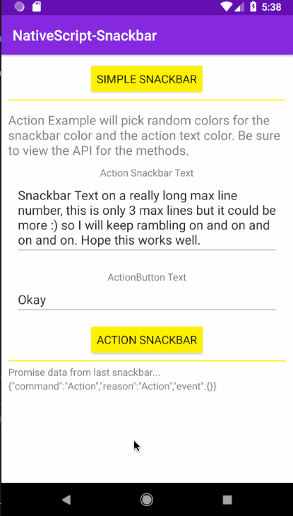

<a align="center" href="https://www.npmjs.com/package/nativescrpt-snackbar">
    <h2 align="center">nativescrpt-snackbar - DO NOT USE THIS, THIS IS A DEMO. You are likely looking for nativescript-snackbar, with the extra 'i' in nativescript</h2>
</a>
<h4 align="center">NativeScript plugin for Material Design Floating Action Button UI component.</h4>

<p align="center">
 <a href="https://www.npmjs.com/package/nativescrpt-snackbar">
        
    </a>
    <a href="https://www.npmjs.com/package/nativescrpt-snackbar">
        
    </a>
     <a href="https://travis-ci.org/bradmartin/nativescrpt-snackbar">
        
    </a>
    <a href="https://github.com/bradmartin/nativescrpt-snackbar/stargazers">
        
    </a>
    <a href="https://paypal.me/bradwayne88">
        
    </a>
</p>

## Demo



## Installation

`tns plugin add nativescrpt-snackbar`

## [Changelog](./CHANGELOG.md)

## Usage

### TS

```typescript
import { SnackBar, SnackBarOptions } from "nativescrpt-snackbar";

// Create an instance of SnackBar
const snackbar = new SnackBar();

/// Show a simple snackbar with no actions
public showSimple() {
    snackbar.simple('Snackbar', 'red', '#fff', 3, false).then((args) => {
         this.set('jsonResult', JSON.stringify(args));
   })
}

/// Show an Action snack bar
public showAction() {
  const options: SnackBarOptions = {
    actionText: this.get('actionText'),
    actionTextColor: '#ff4081', // Optional, Android only
    snackText: this.get('snackText'),
    textColor: '#346db2', // Optional, Android only
    hideDelay: 3500,
    backgroundColor: '#eaeaea', // Optional, Android only
    maxLines: 3, // Optional, Android Only
    isRTL: false, // Optional, Android Only
    view: <View>someView // Optional, Android Only, default to topmost().currentPage
  };

  snackbar.action(options).then((args) => {
    if (args.command === "Action") {
      this.set('jsonResult', JSON.stringify(args));
    } else {
      this.set('jsonResult', JSON.stringify(args));
    }
  });
}
```

### API

Show a simple SnackBar (color args will only work on Android)

- **simple(snackText: string, textColor?: string, backgroundColor?: string, maxLines?: number, isRTL?: boolean, view?: View): Promise<any>**

Show a SnackBar with Action.

- **action(options: SnackBarOptions): Promise<any>**

Manually dismiss an active SnackBar

- **dismiss(): Promise<any>**

### SnackBarOptions Interface

- **actionText: string**
- **actionTextColor: string**
- **snackText: string**
- **hideDelay: number**
- **textColor: string**
- **backgroundColor: string**
- **maxLines: number**
- **isRTL: boolean**
- **view: View**
